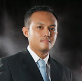

## About Me

A **Senior Software Developer** from Makassar, Indonesia. 13 years professional experience, 8 years in web development. Obsessed with well-crafted software, startup culture and remote-first working environment with asynchronous communication.

## Area of Expertise

 * Test-Driven Development with Clean Code & Architecture
 * CI & CD Pipeline
 * Infrastructure as a Code
 * Technical Leadership & Mentoring

## Tech Stack

 * Docker, Docker-Compose, Docker Swarm, Kubernetes
 * PHP, Python, Javascript
 * Github Actions, Jenkins jobs & pipeline, AWS, Cloudflare
 * Terraform

## Communication

 * I can speak in: Bahasa Indonesia & Malay, English and Arabic
 * I can talk with Engineers, Business People, and Kids

## Who Influence my Engineering Mindset

* [Robert C Martin](http://blog.cleancoder.com/)
* [Martin Fowler](https://martinfowler.com/)
* My Self

## Thoughts

Visit my blog: [Blog](https://blog.solaiman.me)
